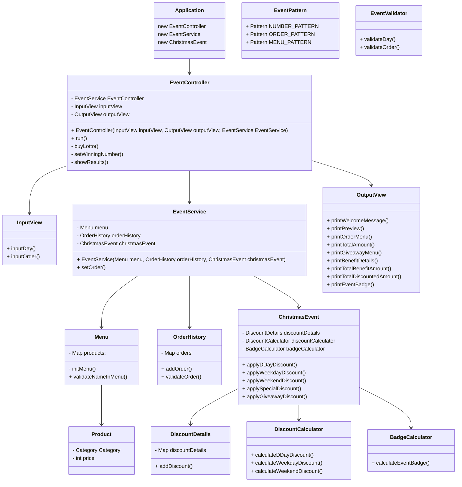

## 🎄크리스마스 프로모션🎁

### ▶️ 12월 이벤트 플래너 실행 방법

터미널에서 다음 명령어로 실행해주세요. (Java 17)

Mac 또는 Linux : `./gradlew clean test`  
Windows : `gradlew.bat clean test` 또는 `./gradlew.bat clean test`

### 📆 12월 이벤트 플래너 주문 순서

```
<애피타이저>
양송이수프(6,000), 타파스(5,500), 시저샐러드(8,000)

<메인>
티본스테이크(55,000), 바비큐립(54,000), 해산물파스타(35,000), 크리스마스파스타(25,000)

<디저트>
초코케이크(15,000), 아이스크림(5,000)

<음료>
제로콜라(3,000), 레드와인(60,000), 샴페인(25,000)
```

1. 방문할 날짜를 입력해주세요.(1 이상 31 이하의 숫자)
2. 주문하실 메뉴와 개수를 알려 주세요. (e.g. 해산물파스타-2,레드와인-1,초코케이크-1)
3. 혜택 미리 보기를 볼 수 있어요.
   (주문 메뉴, 할인 전 총주문 금액, 증정 메뉴, 혜택 내역, 총혜택 금액, 할인 후 예상 결제 금액, 12월 이벤트 배지 내용)

### 🪧 이벤트 주의 사항

- 총주문 금액 10,000원 이상부터 이벤트가 적용됩니다.
- 음료만 주문 시, 주문할 수 없습니다.
- 메뉴는 한 번에 최대 20개까지만 주문할 수 있습니다.
  (e.g. 시저샐러드-1, 티본스테이크-1, 크리스마스파스타-1, 제로콜라-3, 아이스크림-1의 총개수는 7개)

### 🏆 혜택 금액에 따른 12월 이벤트 배지 부여

- 총혜택 금액에 따라 다른 이벤트 배지를 부여합니다. 이 배지는 2024 새해 이벤트에서 활용할 예정입니다. 배지에 따라 새해 이벤트 참여 시, 각각 다른 새해 선물을 증정할 예정입니다.
    - 5천 원 이상: 별
    - 1만 원 이상: 트리
    - 2만 원 이상: 산타

---

## 기능 목록

한줄 핵심 기능 : 날짜가 평일, 주말, 특별일 인지 구별 한다.

✅ 입력 기능

- [x] 방문 날짜 입력 기능
- [x] 주문 메뉴 입력 기능

✅ 출력 기능

- [x] 혜택 미리 보기 출력 기능
- [x] 주문 메뉴 출력 기능
- [x] 할인 전 총주문 금액 출력 기능
- [x] 증정 메뉴 출력 기능
- [x] 혜택 내역 출력 기능
- [x] 총 혜택 내역 출력 기능
- [x] 할인 후 총주문 금액 출력 기능
- [x] 12월 이벤트 배지 출력 기능

✅ 입력 검사 기능

- [x] 방문 날짜 검사 기능
    - [x] [ERROR] 1-31 숫자가 아닌 경우
- [x] 메뉴와 개수 검사 기능
    - [x] [ERROR] 없는 메뉴인 경우
    - [x] [ERROR] 개수가 1이상이 아닌 경우
    - [x] [ERROR] 주문 형식이 다른 경우
    - [x] [ERROR] 메뉴가 중복된 경우
    - [x] [ERROR] 개수가 20개 넘는 경우
    - [x] [ERROR] 음료만 주문한 경우

✅ 12월 달력 (23.12.1~23.12.31) 총 31일

- [x] day type 반환 기능

✅ 확인 기능

- [x] 이벤트 대상인지 확인 기능
    - [X] 10,000원 이상 인지 확인 기능
    - [x] 음료만 있는지 확인 기능
- [x] 할인 혜택 확인 기능
    - [x] 크리스마스 디데이 할인 여부 확인 기능
    - [x] 평일 할인 여부 확인 기능
    - [x] 주말 할인 여부 확인 기능
    - [X] 특별 할인 여부 확인 기능
    - [x] 증정 이벤트 대상 여부 확인 기능

✅ 메뉴판

- 메뉴 저장
- [x] 있는 메뉴인지 확인 기능
- [x] 메뉴별 카테고리 확인 기능
- [x] 가격 반환 기능

✅ 주문 내역

- [x] 주문 내역, 수량 추가 기능
- [x] 수량 20개 넘는지 체크 기능

✅ 이벤트 적용 기능

- [x] 할인 전 총주문 금액 구하는 기능
- [x] 총혜택 금액 구하는 기능
- [x] 할인 후 예상 결제 금액 구하는 기능

- [x] (25일) 까지 1000원으로 시작하여 100원씩 증가하여 할인해주는 기능
- [x] 일~목 디저트 메뉴 1개당 2,023 할인 기능
- [x] 금~토 메인 메뉴 1개당 2,023 할인 기능
- [x] 별이 있는 날 총주문 금액에서 1,000원 할인 기능
- [x] 할인 전 총주문 금액이 12만 원 이상일 때, 샴페인 1개 증정 기능 (+25,000)
- [x] 12월 이벤트 배지 구하는 기능

✅ 보조 기능

- 유효성 검사용 Pattern 생성

### 📦 package 구조

- Controller
    - EventController
- Domain
    - event
        - ChristmasEvent
        - BadgeCalculator
        - DiscountCalculator
        - DiscountDetails
    - menu
        - Menu
    - OrderHistory
    - Product
- Service
    - EventService
- Util
    - EventPattern
    - EventValidator
- View
    - InputView
    - OutputView



### 🚀 달성 목표

- TDD 사용해보기
    - 테스트 코드를 먼저 작성 후 기능을 구현한다.
- 객체를 최대한 분리하기
    - ChristmasEvent 객체를 최대한 분리한다.
- 클래스 작성 시 도메인 로직에 집중하기

### 📜 피드백 적용 사항

- 객체는 객체스럽게 사용한다.
    - 데이터를 꺼내지 않고 메세지를 던져 객체가 일하도록 한다.
- 불필요한 필드를 줄인다.
    - 바로 구할 수 있는 값은 저장해놓지 않는다.